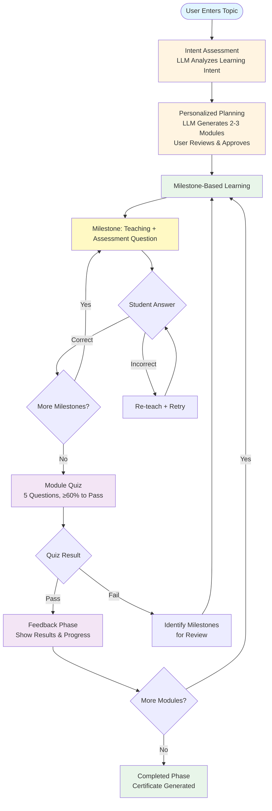
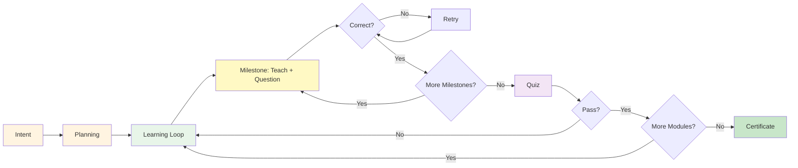

# Figure 1: System Overview - Compact Version

## Mermaid Diagram Code (Ready to Use)

## Key Improvements

1. **Single Milestone Pattern**: Instead of showing M1, M2, M3 explicitly, shows one "Milestone" box with a loop
2. **"More Milestones?" Decision**: Shows the pattern repeats until all milestones in module are complete
3. **More Compact**: Reduces visual complexity while maintaining clarity
4. **Clear Loop Structure**: Shows how milestone learning repeats within a module

## Figure Caption

**Figure 1: System Overview.** The diagram illustrates the key components and workflow of the Learning with LLMs platform. The system follows a structured learning flow: (1) **Intent Assessment**, where the LLM analyzes the user's learning intent; (2) **Personalized Planning**, where a 2-3 module learning plan is generated and approved; (3) **Milestone-Based Learning**, where students progress through sequential milestones (3-6 per module) by correctly answering assessment questions—each milestone follows the pattern of teaching content, assessment question, and retry mechanism for incorrect answers; (4) **Module Quiz**, a 5-question assessment requiring ≥60% to pass; (5) **Feedback**, showing results and progress; and (6) **Completion**, where certificates are generated after all modules are completed. The system loops back to milestone learning for subsequent modules until all are completed. Failed quizzes trigger review of specific milestones before retaking the quiz.

## How to Use

1. Copy the Mermaid code above
2. Paste into https://mermaid.live to preview
3. Export as PNG/SVG for your paper
4. Or use the code in your markdown/documentation

## Alternative: Even More Compact (if needed)

If you need it even more compact, you could combine some phases:

