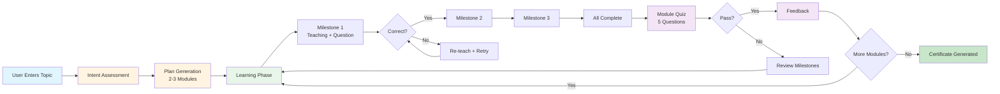

# Figure 1: System Overview - Visual Specification

## Recommended Layout

The figure should be organized in a horizontal flow diagram showing the learning journey from start to completion.

## Visual Elements

### Main Flow (Top Section)
```
[User Input: Topic] 
    ↓
[Intent Assessment Phase]
    ↓
[Planning Phase: Generate & Approve Plan]
    ↓
[Learning Phase: Milestone Progression]
    ↓
[Quizzing Phase: Module Quiz]
    ↓
[Feedback Phase: Results & Progress]
    ↓
{More Modules?}
    ├─ Yes → [Learning Phase: Next Module]
    └─ No → [Completed: Certificate Generated]
```

### Milestone Learning Detail (Middle Section - Expandable)
```
Module 1
├─ Milestone 1: Teaching → Assessment Question
│   ├─ Correct → Milestone 2
│   └─ Incorrect → Re-teach → Retry
├─ Milestone 2: Teaching → Assessment Question
│   ├─ Correct → Milestone 3
│   └─ Incorrect → Re-teach → Retry
└─ Milestone 3: Teaching → Assessment Question
    └─ All Complete → Quiz
```

### LLM Agents (Bottom Section - Optional)
```
[Intent Analyzer] → [Plan Generator] → [Conversation Manager] 
    → [Teacher Agent] → [Assessment Analyzer] → [Quiz Generator]
```

## Color Coding Suggestions

- **Intent/Planning**: Orange/Yellow tones (warm, planning phase)
- **Learning**: Green tones (active learning)
- **Quizzing/Feedback**: Purple tones (assessment)
- **Completed**: Dark green (success)
- **LLM Agents**: Light yellow/beige (background processing)

## Text Annotations

1. **Intent Assessment**: "LLM analyzes learning intent"
2. **Planning**: "Generate 2-3 modules, user approves"
3. **Milestone Learning**: "Sequential progression, assessment questions"
4. **Quiz**: "5 questions, ≥60% to pass"
5. **Feedback**: "Results shown, next module or completion"

## Alternative: Simplified Flow Diagram

For a cleaner, more conference-appropriate figure:

```
┌─────────────────────────────────────────────────────────────┐
│                    LEARNING WITH LLMs                        │
│                  System Overview Flow                        │
└─────────────────────────────────────────────────────────────┘

[User] → Intent → Planning → Learning → Quiz → Feedback → Complete
          ↓         ↓          ↓         ↓        ↓          ↓
        LLM      LLM       LLM      LLM      LLM       Certificate
      Analyzer  Generator  Teacher  Quiz     Feedback   Generation
                              ↓
                        Milestone 1 → Milestone 2 → Milestone 3
                        (Assessment)  (Assessment)  (Assessment)
```

## Figure Caption Text

**Figure 1: System Overview.** The diagram illustrates the key components and workflow of the Learning with LLMs platform. The system follows a structured learning flow: (1) **Intent Assessment**, where the LLM analyzes the user's learning intent; (2) **Personalized Planning**, where a 2-3 module learning plan is generated and approved; (3) **Milestone-Based Learning**, where students progress through sequential milestones (3-6 per module) by correctly answering assessment questions; (4) **Module Quiz**, a 5-question assessment requiring ≥60% to pass; (5) **Feedback**, showing results and progress; and (6) **Completion**, where certificates are generated after all modules are completed. The system uses multiple specialized LLM agents that orchestrate the learning experience while maintaining context coherence through structured state management.

## Design Guidelines

1. **Flow Direction**: Left to right (standard for process flows)
2. **Decision Points**: Use diamond shapes for yes/no decisions
3. **Phases**: Use rounded rectangles for phases
4. **LLM Agents**: Use smaller boxes or icons below main flow
5. **Milestone Detail**: Can be shown as expandable section or separate inset
6. **Font Size**: Ensure readability at typical paper figure sizes (3-4 inches wide)

## Tools for Creation

- **Draw.io / diagrams.net**: Free, exports to SVG/PNG
- **Figma**: Professional design tool
- **Lucidchart**: Flowchart tool
- **Mermaid Live Editor**: https://mermaid.live (for quick preview)
- **PowerPoint/Keynote**: Simple shapes and arrows

## Example Mermaid Code (for reference)


