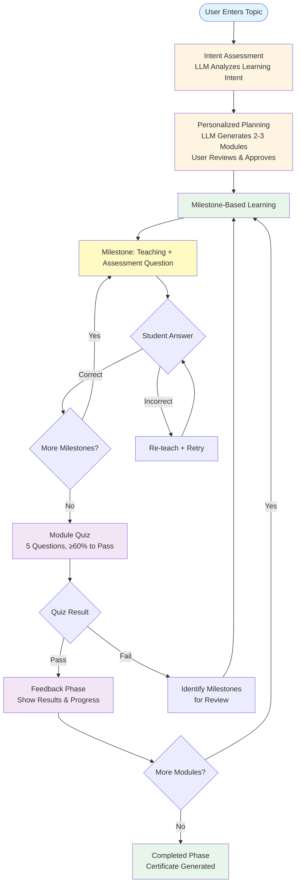
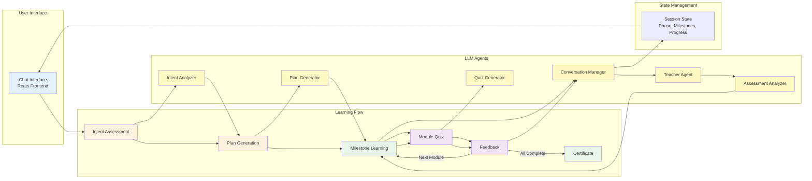

# Figure 1: System Overview

## Mermaid Diagram Code (for rendering) - Compact Version

## Alternative: Detailed System Architecture Diagram

## Figure 1 Description for Paper

**Figure 1: System Overview.** The diagram illustrates the key components and workflow of the Learning with LLMs platform. The system follows a structured learning flow: (1) **Intent Assessment**, where the LLM analyzes the user's learning intent; (2) **Personalized Planning**, where a 2-3 module learning plan is generated and approved; (3) **Milestone-Based Learning**, where students progress through sequential milestones (3-6 per module) by correctly answering assessment questions—each milestone follows the pattern of teaching content, assessment question, and retry mechanism for incorrect answers; (4) **Module Quiz**, a 5-question assessment requiring ≥60% to pass; (5) **Feedback**, showing results and progress; and (6) **Completion**, where certificates are generated after all modules are completed. The system loops back to milestone learning for subsequent modules until all are completed. Failed quizzes trigger review of specific milestones before retaking the quiz.
