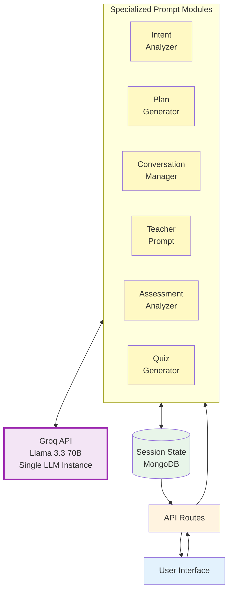
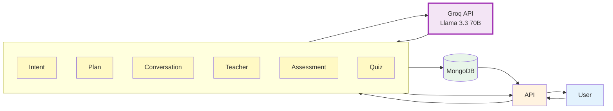
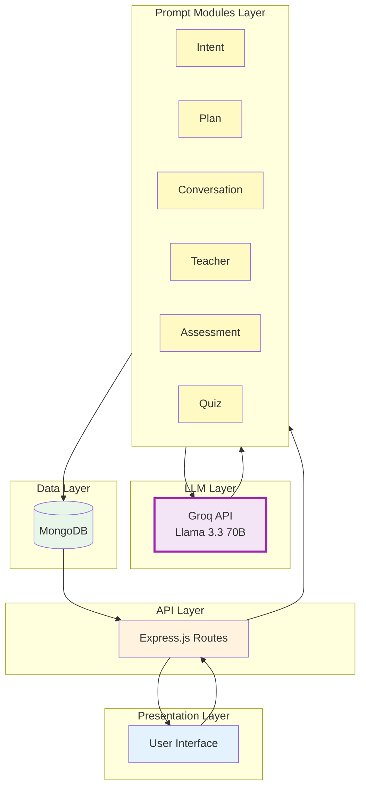

# Figure 2: Multi-Prompt LLM Architecture - Clean Version

## Recommended: Simple & Clean Diagram

## Even Simpler: Minimal Version

## Alternative: Layered Architecture (Cleanest)

## Figure 2 Caption

**Figure 2: Multi-Prompt LLM Architecture.** The system uses a single LLM instance (Groq API with Llama 3.3 70B) with specialized prompt modules that orchestrate different aspects of the learning flow. Each prompt module (Intent Analyzer, Plan Generator, Conversation Manager, Teacher Prompt, Assessment Analyzer, Quiz Generator) builds context-specific prompts for the same LLM, enabling specialized outputs for different tasks. All prompt modules share the same LLM instance and maintain context coherence through structured state management in the Session model (MongoDB).
