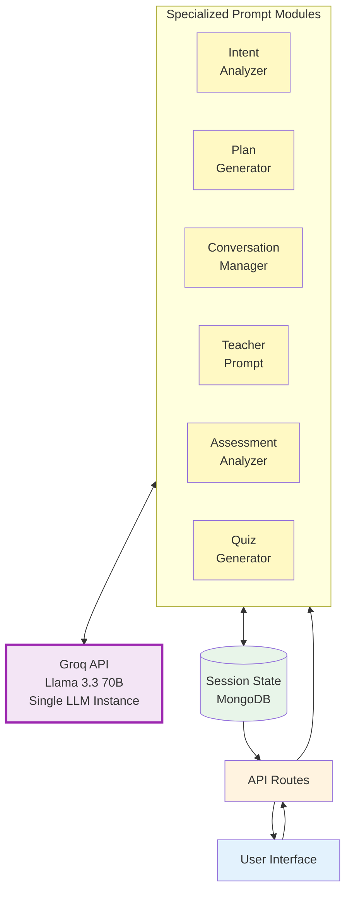
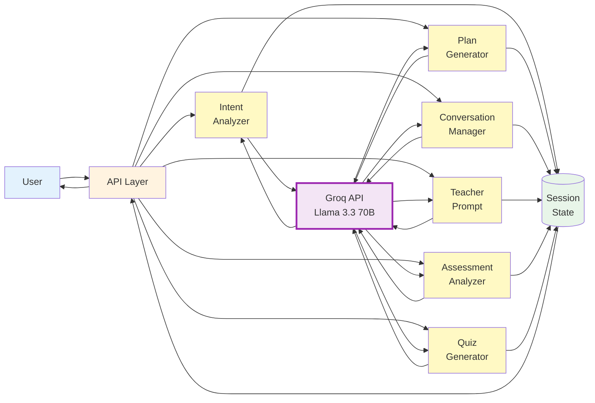
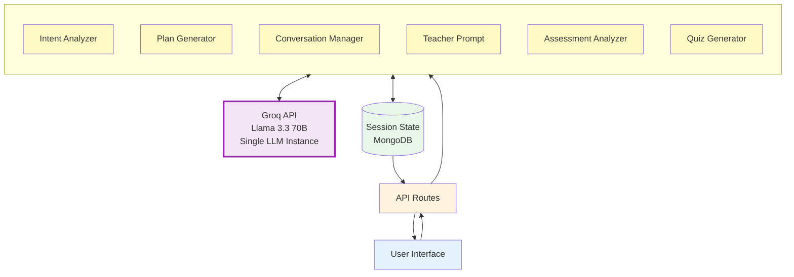

# Figure 2: Multi-Prompt LLM Architecture

## Accurate Terminology

You're correct! The system uses:
- **Single LLM** (Groq API with Llama 3.3 70B)
- **Specialized Prompt Modules** (different prompt builders for different tasks)
- **Not separate agents** - just different prompts to the same LLM

## Recommended: Clean & Simple Diagram (Use This One)

## Alternative: Simplified Flow Diagram

## Recommended: Clean Architecture Diagram (Use This One)

## Figure 2 Caption

**Figure 2: Multi-Prompt LLM Architecture.** The system uses a single LLM instance (Groq API with Llama 3.3 70B) with specialized prompt modules that orchestrate different aspects of the learning flow. Each prompt module (Intent Analyzer, Plan Generator, Conversation Manager, Teacher Prompt, Assessment Analyzer, Quiz Generator, Context Summarizer) builds context-specific prompts for the same LLM, enabling specialized outputs for different tasks. The Conversation Manager orchestrates the learning flow by making decisions about phase transitions and actions, while other modules handle specific tasks like generating teaching content, analyzing student responses, or creating quizzes. All modules share the same LLM instance and maintain context coherence through structured state management in the Session model.

## Updated Terminology for Paper

Instead of "multi-agent system," use:
- **"Multi-prompt LLM architecture"**
- **"Specialized prompt modules"**
- **"LLM-based orchestration system"**
- **"Prompt-based component system"**

## Key Points to Emphasize

1. **Single LLM Instance**: All prompt modules use the same Groq API client
2. **Specialized Prompts**: Each module builds different prompts for different tasks
3. **Orchestration**: Conversation Manager coordinates the flow
4. **Context Sharing**: All modules access the same Session state
5. **Efficiency**: Reusing the same LLM instance is more token-efficient than separate agents
