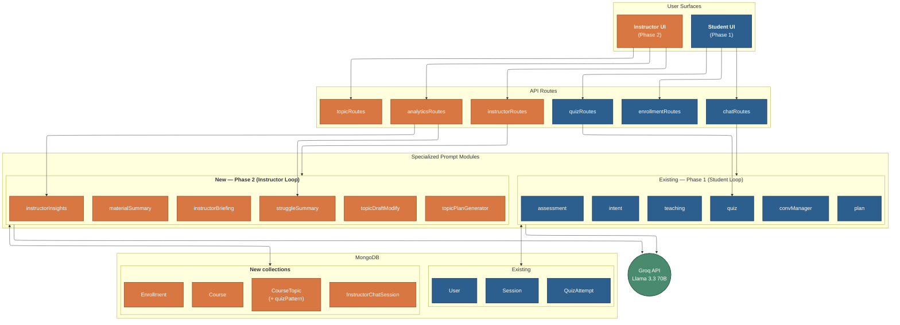

# Figure 3: Instructor & student surfaces — Phase 1 / Phase 2 architecture

Architecture overview: UI surfaces, API routes, prompt modules (student loop vs instructor loop), Groq LLM, and MongoDB collections.

