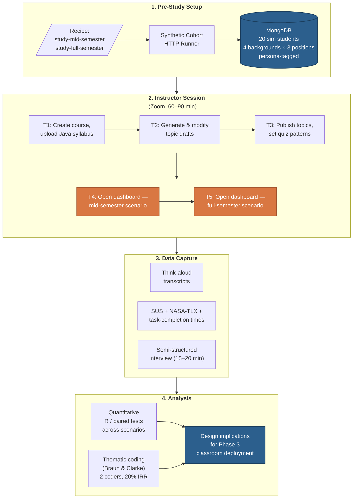

# Figure 4: Instructor study — workflow (setup → session → data → analysis)

End-to-end flow: synthetic cohort prep, live instructor session tasks, captured measures, and analysis pipeline.

```mermaid
%%{init: {
  "flowchart": {
    "htmlLabels": true,
    "padding": 16,
    "nodeSpacing": 28,
    "rankSpacing": 48,
    "curve": "basis"
  },
  "themeVariables": {
    "fontSize": "16px",
    "fontFamily": "system-ui, -apple-system, BlinkMacSystemFont, sans-serif"
  }
}}%%
flowchart TB
    subgraph PREP["<b>1. Pre-Study Setup</b>"]
        direction LR
        REC[/"Recipe:<br/>study-mid-semester<br/>study-full-semester"/]
        RUN["Synthetic Cohort<br/>HTTP Runner"]
        COHORT[("MongoDB<br/>20 sim students<br/>4 backgrounds &times; 3 positions<br/>persona-tagged")]
        REC --> RUN --> COHORT
    end

    subgraph SESS["<b>2. Instructor Session</b><br/>(Zoom, 60&ndash;90 min)"]
        direction TB
        subgraph SESS_R1[" "]
            direction LR
            T1["T1: Create course,<br/>upload Java syllabus"]
            T2["T2: Generate &amp; modify<br/>topic drafts"]
            T3["T3: Publish topics,<br/>set quiz patterns"]
            T1 --> T2 --> T3
        end
        subgraph SESS_R2[" "]
            direction LR
            T4["T4: Open dashboard &mdash;<br/>mid-semester scenario"]
            T5["T5: Open dashboard &mdash;<br/>full-semester scenario"]
            T4 --> T5
        end
        SESS_R1 --> SESS_R2
    end

    subgraph DATA["<b>3. Data Capture</b>"]
        direction LR
        TA["Think-aloud<br/>transcripts"]
        SCALES["SUS + NASA-TLX +<br/>task-completion times"]
        INTV["Semi-structured<br/>interview (15&ndash;20 min)"]
    end

    subgraph ANA["<b>4. Analysis</b>"]
        direction LR
        QUANT["Quantitative<br/>R / paired tests<br/>across scenarios"]
        QUAL["Thematic coding<br/>(Braun &amp; Clarke)<br/>2 coders, 20% IRR"]
        SYNTH["Design implications<br/>for Phase 3<br/>classroom deployment"]
        QUANT --> SYNTH
        QUAL --> SYNTH
    end

    PREP --> SESS
    SESS --> DATA
    DATA --> ANA

    classDef phase fill:#F2EEE5,stroke:#6B6B6B,color:#222222,stroke-width:1.5px
    classDef key fill:#2C5F8D,stroke:#1A3D5C,color:#FFFFFF,stroke-width:1.5px
    classDef accent fill:#D97742,stroke:#9C4F2A,color:#FFFFFF,stroke-width:1.5px
    class T4,T5 accent
    class COHORT,SYNTH key

    style SESS_R1 fill:transparent,stroke:transparent
    style SESS_R2 fill:transparent,stroke:transparent
```
